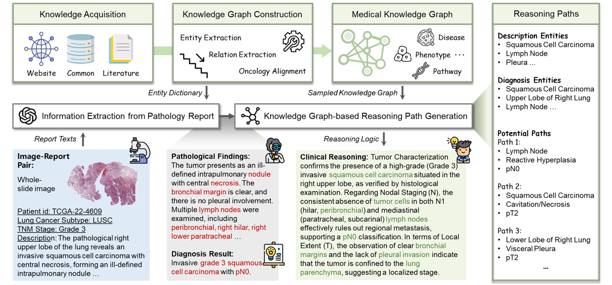
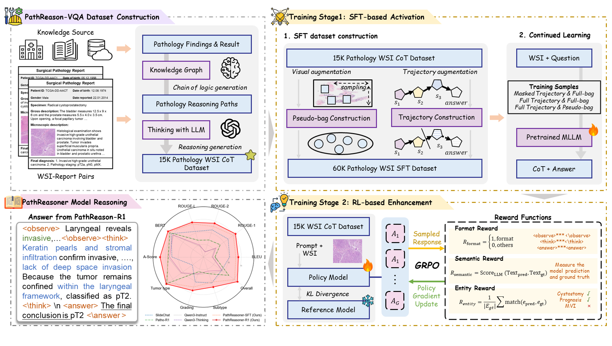

# PathReasoner-R1: Empowering Pathology Vision-Language Models with Structured Diagnostic Reasoning

<!--  -->

<!--  -->

Current Vision-Language Models (VLMs) in computational pathology often function as "black boxes," providing direct diagnosis without verifiable evidence. **PathReasoner-R1** bridges this gap by introducing structured Chain-of-Thought (CoT) reasoning into pathology, transforming models from simple classifiers into transparent clinical reasoners.

---

## 🌟 Key Highlights

* PathReasoner Dataset**: The first large-scale Whole-Slide Image (WSI) reasoning dataset. It contains **15K+ high-quality instruction samples** where findings and clinical reasoning are explicitly aligned with diagnoses.
* Knowledge-Guided Generation**: Unlike traditional unverified distillation, we use **Medical Knowledge Graphs** to generate rigorous, structured pathological reasoning trajectories.
* PathReasoner-R1 Framework**: A two-stage training framework that combines **dual-modality SFT augmentation** with **knowledge-aware reinforcement learning (RL)**.
* Knowledge-Aware Reward Function**: Incorporates a specialized **Entity Reward mechanism** strictly aligned with knowledge graphs to optimize for logical consistency and eliminate hallucinations.
* State-of-the-Art Performance**: Achieves SOTA results across multiple benchmarks and image scales, providing clinically grounded and transparent decision-making.

---

## 🖼️ Methodology

### 1. Knowledge-Guided Data Pipeline
We leverage medical knowledge graphs to convert raw pathology findings into structured reasoning paths. This ensures that every diagnosis is backed by a verifiable chain of evidence.
> 
<!-- >  -->

### 2. PathReasoner-R1 Training Strategy
*   **Phase 1: Dual-Modality SFT Augmentation** — trajectory masking on text and entity-drop-guided pseudo-bag masking on WSI features, teaching the model to reason reliably under partial evidence.
*   **Phase 2: Knowledge-Aware RL** — a multi-granular reward (format + semantic + entity) whose Entity Reward grounds each reasoning step in KG-verified medical concepts.

> 
<!-- >  -->

---

## 📊 Dataset: PathReasoner

**PathReasoner** provides a leap in data quality for CPath:
- **Scalability**: Over 15,000 instruction-following reasoning pairs.
- **Granularity**: Covers multiple image scales.
- **Rigor**: Every sample is aligned with a medical knowledge graph to ensure clinical validity.
- **Available on Hugging Face**: [jshhhh/PathReasoner](https://huggingface.co/datasets/jshhhh/PathReasoner) *(Coming Soon)*
---

## 🚀 Quick Inference
To run a quick inference with PathReasoner-R1, use the code in [`./src/demo.py`](./src/demo.py)

---
## 📕KG-related repos used in PathReasoner:
* PrimeKG (Medical KG): [https://dataverse.harvard.edu/dataset.xhtml?persistentId=doi:10.7910/DVN/IXA7BM](https://dataverse.harvard.edu/dataset.xhtml?persistentId=doi:10.7910/DVN/IXA7BM)
* PathoGraph (Pathology KG): [https://github.com/Peiliang/PathoML](https://github.com/Peiliang/PathoML)
* MedResearch-R1 （Trajectory masking）: [https://github.com/AQ-MedAI/MedResearcher-R1](https://github.com/AQ-MedAI/MedResearcher-R1)
* MedReason（Entity extraction）: [https://github.com/UCSC-VLAA/MedReason](https://github.com/UCSC-VLAA/MedReason)

---

## 🤝 License & Disclaimer
This project is licensed under the **Apache 2.0 License**. 
**Disclaimer**: This model is for research purposes only. Always consult with a qualified pathologist for clinical decisions.